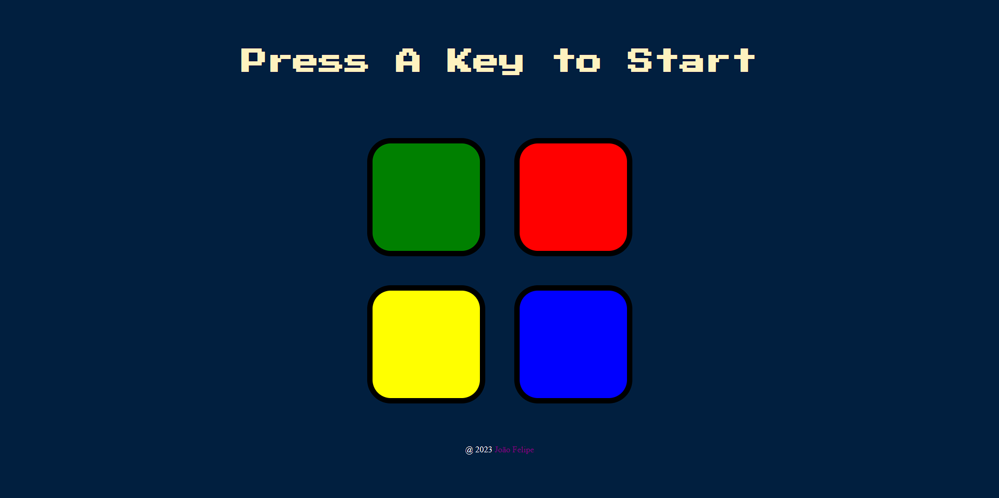

# Frontend Mentor - Results summary component solution

This is a solution to the Simon Game Challenge of course The Complete 2023 Web Development Bootcamp  (Udemy);

## Table of contents

- [Overview](#overview)
  - [Screenshot](#screenshot)
  - [Links](#links)
- [My process](#my-process)
  - [Built with](#built-with)
  - [What I learned](#what-i-learned)
  - [Continued development](#continued-development)
  - [Useful resources](#useful-resources)
- [Author](#author)

## Overview

### Screenshot

### Links

- Solution URL: [Add solution URL here](https://github.com/FelipeMT21/simon-game-challenge)
- Live Site URL: [Add live site URL here](https://felipemt21.github.io/simon-game-challenge/)

## My process

### Built with

- Semantic HTML5 markup.
- CSS custom properties.
- JavaScript to generate random numbers, creation of if and else structures, anonymous functions, and already defined functions. 
- DOM and jQuery for manipulating HTML and CSS.

### What I learned

I have learned a lot about how to use JavaScript, the DOM, jQuery, and create functions to decrease code repetition.

### Continued development

"I need to keep learning more about DOM, jQuery and JavaScript to achieve fluency in using these tools.

### Useful resources

- [Developers Google](https://developers.google.com/speed/libraries?hl=pt-br#jquery) - On this website, I have obtained the most up-to-date jQuery command script to apply in my code.
- [W3Schools](https://www.w3schools.com/jquery/jquery_ref_effects.asp) - On this website, I have obtained some jQuery commands to customize my code.
- [W3Schools](https://stackoverflow.com/questions/275931/how-do-you-make-an-element-flash-in-jquery) - This website has helped me a lot with some questions I had.

## Author

- Website - [João Felipe](https://felipemt21.github.io/curriculo/)
- Frontend Mentor - [@FelipeMT21](https://www.frontendmentor.io/profile/FelipeMT21)
